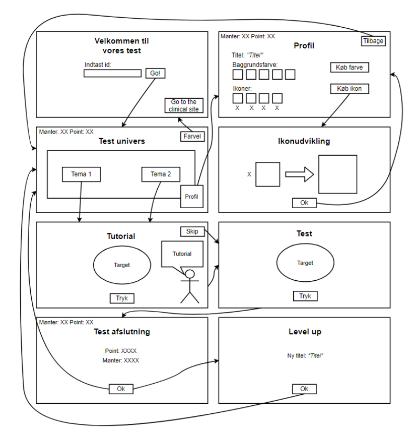
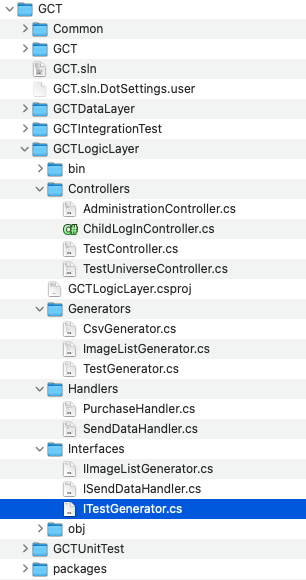
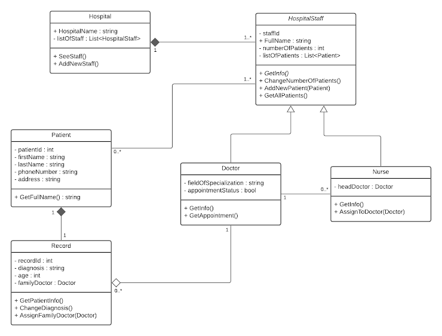
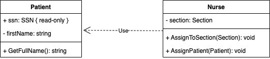
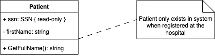

<!-- .slide: data-background="#003d73" -->

## UML

### Class diagrams

 <!-- .element style="width: 200px; position: fixed; bottom: 50px; left: 50px" -->

----

### Agenda

* What is UML
    * The why
* Class diagrams

---

## Problem

* As engineers you will design and build large software systems
* How would you start designing
    * a calendar?
    * a suitcase management system?
    * an EPJ system?
* How to validate that the 'design' is good enough?

----

### Testing Childrens Cognetive ability

[Gamified Cognetive Test](https://orbit-lab-portfolio.web.app/project/gamified-cognitive-test)

 <!-- .element: style="height: 500px;" -->

----

## Solution overview

---

## UML

* Unified Modeling language
* Standard develop by [OMG](https://www.uml.org/)
* Current version [2.5.1](https://www.omg.org/spec/UML/2.5.1/PDF)
* Specification is in UML

----

### UML

* UML is a very by modeling language
    * Specifications is 800 pages
* We will just use a subset of this
    * Class diagrams
    * Sequence diagrams
* Other usefull diagrams
    * Package
    * State machine
    * Timeing
    * E.T.C.

----

### Why use UML?

* Formel
    * Designing software
    * Documenting software
* Informal
    * Test software design
    * Validate software design
* Language agnostic

---

## Class diagrams

* Static diagram type
* Describe types in a system
    * and relationship between these

----

### Examples

----

### Classes

* Three compartments:
    * **class name** 
    * Attributes
    * Operations
* Private attributes
    * Reveals internal working of class
    * Breaks which Object Oriented 'rule'?

<!-- .slide: style="font-size: 36px" -->

----

#### Attributes & Methods

* Attributes 
`visibility name: type multiplicity = default {property}`<!-- .element: style="font-size: 30px" -->
* Operations:  
`visibility name (parameter-list): return-type {property}`<!-- .element: style="font-size: 30px" -->
    * Normally methods

----

#### Types of classes

* We talk about this next time in detail.

---

### Relations

[https://dilbert.com/strip/2013-09-21](https://dilbert.com/strip/2013-09-21)

----

#### Association

* *Solid line with open arrow and directed line between two objects*
* Another way to show properties
* Association over properties
    * If class are importent

<!-- .slide: style="font-size: 36px" -->

----

#### Composition

* *Solid line with filled diamod - can be directed*
* Owner
* Lifecycle of object is controlled by
* We **do not** use Aggregation (open diamond)

----

#### Dependency

* *Dotted line with open arrow*
* Changes in **supplier** causes changes in **client**
     * who is client? and supplier?
* Dependency is not transitive
* Minimize depencies
    * Especially between packages\*

\* Groups of classes (like a .NET project)<!-- .element: style="font-size: 26px" -->

<!-- .slide: style="font-size: 36px" -->

----

#### Inheritance

* *Solid line with close arrow*
* Extending or subclasing
* Meaning substitutability

----

#### Implementation

* *Dotted line with close arrow*
* We talk about this next time in detail.

----

#### Cardinality

* Added to one or both ends of relation
* Multiplicity '1', '1..5', '0..*' or '*'
* `{ordered}`, `{unique}`, ...
* When translating to code, this can mean different things 

Lets see!

----

#### Notes

* Can be attached to classes, relations etc.

---

### References

* [https://dilbert.com/strip/2013-09-21](Dilbert commic)
* [Hospital UML diagram](https://www.uml-diagrams.org/examples/hospital-management-example.html)