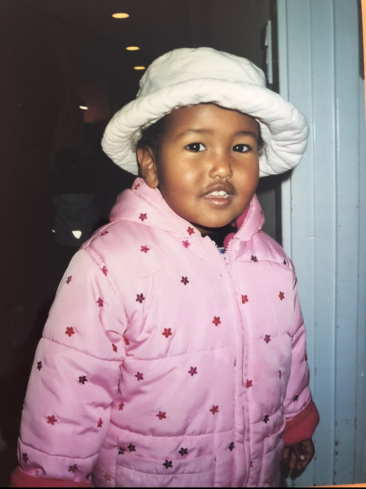

<!-- .slide: data-background="#003d73" -->

## ST2ITS2

### Introduction

 <!-- .element style="width: 200px; position: fixed; bottom: 50px; left: 50px" -->

---

<!-- .slide: data-background-image="./img/teachers.png" -->

## Teachers <!-- .element: style="color:#003d73; background-color: #ffffff" -->

----

### TA's

* We have two skilled  TAs
* Both are 4th semester ST students
* Marwo Xasan
* Nikolaj Matzen

 <!-- .element: style="position: absolute; top: 50%; left: -15%; width: 300px; height: 300px;" -->

 <!-- .element: style="position: absolute; top: 50%; right: -15%; width: 300px; height: 300px;" -->

----

### Henrik Bitsch Kirk

* Graduated from Computer Science 2009
* Work (programmer)
    * Danish National Library 2009-2010
    * Visiolink 2011-2014
    * Cetrea 2014
    * Lapio 2014-2015
    * Mj&#248;lner 2015-2017
    * ECE 2017-

 <!-- .element: style="position: absolute; top: 50%; right: 10%; width: 300px" -->

---

<!-- .slide: data-transition="slide-in fade-out" -->

## Qualifications

* Identify and use object-oriented concepts and principles
* Explain and apply the basic principles in an object-oriented programming language, including inheritance, polymorphism, and interfaces for the development of easily maintained programs.
* Explain and implement the different types of class relationships
* Design and implement simple generalisation and specialisation hierarchies using inheritance.
* Identify and explain correlations in an object-oriented UML class diagram and implement this by dividing a program into modules.
* Explain static and dynamic memory allocation and apply it in specific programs.
* Know and apply the basic principles of exceptions in simple situations.
* Be able to use the MVVM architecture to implement applications with a graphical user interface for Microsoft Windows.
* Apply data binding to associate data in the model layer with their presentation in the view layer.

<!-- .slide: style="font-size: 28px" -->

----

<!-- .slide: data-transition="fade-in fade-out" -->

## Qualifications 

* Identify and use **object-oriented concepts and principles**<!-- .element: style="color: #000000" -->
* Explain and apply the basic principles in an object-oriented programming language, including **inheritance, polymorphism, and interfaces**<!-- .element: style="color: #000000" --> for the development of easily maintained programs.
* Explain and implement the different types of **class relationships**<!-- .element: style="color: #000000" -->
* Design and implement simple **generalisation and specialisation**<!-- .element: style="color: #000000" --> hierarchies using inheritance.
* Identify and explain correlations in an object-oriented **UML class diagram**<!-- .element: style="color: #000000" --> and implement this by dividing a program into modules.
* Explain **static and dynamic memory allocation**<!-- .element: style="color: #000000" --> and apply it in specific programs.
* Know and apply the basic principles of **exceptions**<!-- .element: style="color: #000000" --> in simple situations.
* Be able to use the **MVVM architecture**<!-- .element: style="color: #000000" --> to implement applications with a graphical user interface for Microsoft Windows.
* Apply **data binding**<!-- .element: style="color: #000000" --> to associate data in the model layer with their presentation in the view layer.

<!-- .slide: style="font-size: 28px; color: #00000055; " -->

----

<!-- .slide: data-transition="fade-in slide-out" -->

## Qualifications

* **Identify**<!-- .element: style="color: #000000" --> and use object-oriented concepts and principles
* **Explain**<!-- .element: style="color: #000000" --> and **apply**<!-- .element: style="color: #000000" --> the basic principles in an object-oriented programming language, including inheritance, polymorphism, and interfaces for the development of easily maintained programs.
* **Explain**<!-- .element: style="color: #000000" --> and **implement**<!-- .element: style="color: #000000" --> the different types of class relationships
* **Design**<!-- .element: style="color: #000000" --> and **implement**<!-- .element: style="color: #000000" --> simple generalisation and specialisation hierarchies using inheritance.
* **Identify**<!-- .element: style="color: #000000" --> and **explain**<!-- .element: style="color: #000000" --> correlations in an object-oriented UML class diagram and implement this by dividing a program into modules.
* **Explain**<!-- .element: style="color: #000000" --> static and dynamic memory allocation and apply it in specific programs.
* **Know**<!-- .element: style="color: #000000" --> and **apply**<!-- .element: style="color: #000000" --> the basic principles of exceptions in simple situations.
* Be able to use the MVVM architecture to implement applications with a graphical user interface for Microsoft Windows.
* **Apply**<!-- .element: style="color: #000000" --> data binding to associate data in the model layer with their presentation in the view layer.

<!-- .slide: style="font-size: 28px; color: #00000055; " -->

Note:

* Uni structural
    * Identify, know
* Multi structural
* Relational
    * Explain, Apply, Explain, Implement
* Extended Abstraction

---

## Course

* Lectures (theory, code examples, exercise solutions)
* Lots of exercises
* Curriculium
    * Head First C#
    * Extra chapters from github
    * A few articles

----

### Github

[Github material](https://github.com/hkirk/ST2ITS2_Material)

*
*

 <!-- .element: style="position: absolute; top: 60%; right: 10%;" -->

 <!-- .element: style="position: absolute; top: 90%; right: 30%; height: 600px;" -->

----

### Schedule

Will properly change a bit

 <!-- .element: style="height: 500px;" -->

----

### Exam

* Oral exam approx. 30 minutes with grading
    * Drag unknown UML exercise (diagram)
    * Explain and implement part of this.
* No preperation
* **Internal** co-examiner, **7-point** grading scale

---

## 2nd time <!-- .element: style="color:#003d73; background-color: #ffffff" -->

<!-- .slide: data-background-image="./img/byggeriet-i-skejby-i-2014.jpg" -->

note: 
Kilde: https://www.fmbygningsdrift.dk/referencer/det-nye-universitetshospital-skejby-dnu-skejby/

----

## Our Expectations

* You tell us 
    * if something could be made better
    * is not working
* Read and watch given material **and** look at the exercises before classe
* You ask questions when something is difficult
    * We have **TA's** in the course, plus '**lektiecafe**' where you can get help outside lectures
* You write lots and lots of code before the exam
    * You practice at home.

----

### Your expectations

Talk to student(s) sitting next to you.

* What do you expect to learn from this course?
* What do expect to be difficult?
* What do you look forward to?
* What should we do as teachers?

----

<!-- .slide: data-background-image="./img/learning_pit.jpeg" data-background-size="contain" -->

---

### References

* [BigLifeJournal](https://biglifejournal.com/ "")