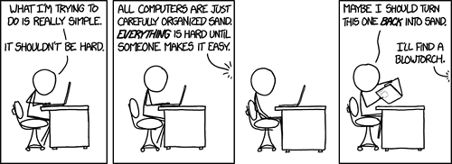

 <!-- .element: style="height: 250px" -->

----

<!-- .slide: data-background-image="./img/learning_pit.jpg" data-background-size="contain" -->

---

### What has been hard? 

Use 5 minutes to figure out what has been hard in ST1ITS1

Go to [menti.com - 7165 5350](https://www.menti.com/al3of75qwx4f)

Note:
TODO: https://www.mentimeter.com/app/presentation/al1reenfab34j6ehho35rpsaq5b72u62/8bqouip4uyso/edit

----

### Control structure

*"Apply control structures in a simple context"*

* if
* switch
* [while](https://learn.microsoft.com/en-us/dotnet/csharp/language-reference/statements/iteration-statements)
* for
* foreach

----

### Datastructures

*"Apply selected data structures for data storage"*

* [List](https://learn.microsoft.com/en-us/dotnet/api/system.collections.generic.list-1?view=net-7.0)
* Arrays
* Dictionary

----

### Classes

*"Apply the basic principles of object-based programming"*

* [class](https://learn.microsoft.com/en-us/dotnet/csharp/fundamentals/tutorials/classes)
* fields
* properties
    * immutable
* constructor
    * with parameters
* method
    * void
    * return types

---

### References

* [xkcd.com](https://xkcd.com/)
* [biglifejournal.com](https://biglifejournal.com/)