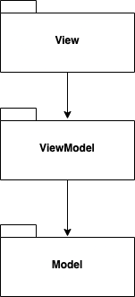
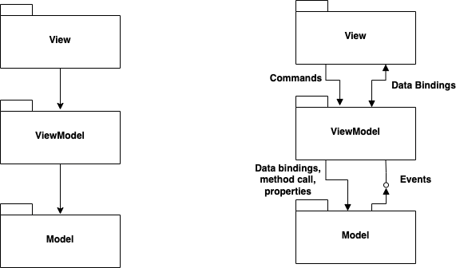
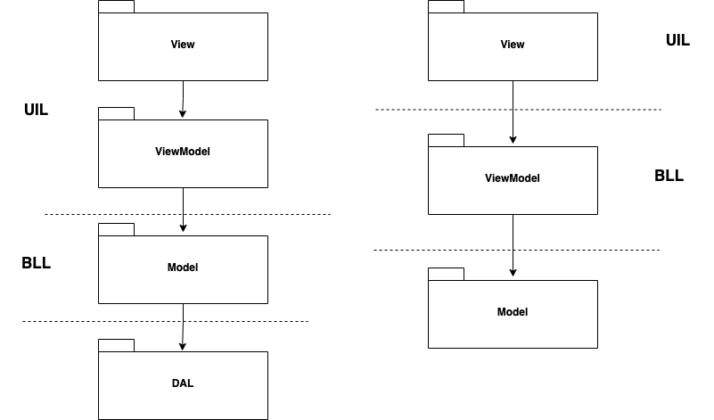

<!-- .slide: data-background="#003d73" -->

## MVVM

### Model-View-ViewModel


 <!-- .element style="width: 200px; position: fixed; bottom: 50px; left: 50px" -->

----

## Agenda

* Problem
* MVVM
* Other GUI Patterns

---

### `ListBox`

[ListView](https://learn.microsoft.com/en-us/dotnet/maui/user-interface/controls/listview?view=net-maui-8.0 "ListView")


```xml
// In XAML file
<ListView ItemsSource="{Binding Monkeys}" />
```

* Shows a list of selectable items in a MAUI application<br/><!-- .element: class="fragment" -->
* Items can be static or dynamic.<br/><!-- .element: class="fragment" -->
    * Above examples is dynamic.

----

### `ObservableCollection<T>`

[ObservableCollection<T>](https://learn.microsoft.com/en-us/dotnet/api/system.collections.objectmodel.observablecollection-1?view=net-8.0)

* <!-- .element: class="fragment" -->A dynamic collection like List<T><br/>
* Provides notifications when the list is mutated (changed)<br/><!-- .element: class="fragment" -->
    * E.g. `Add`, `Remove` and `Clear` operations
* In MAUI this means that bindings are automaticaly updated<br/><!-- .element: class="fragment" -->

---

## Problem


 <!-- .element: style="height: 300px" -->

Can we reuse our current both an operation setup and a practitioner consultation? <!-- .element: class="fragment" -->

----

### Reuse

* Hopefully we could reuse<br/><!-- .element: class="fragment" -->
    * Data access code
    * Business logic code
* UI Forms and controls<br/><!-- .element: class="fragment" -->
    * We can properly reuse the forms and controls
* What a about alarms - showing when the presure is to high or to low<br/><!-- .element: class="fragment" --> 
    * And still have these testable

note: 

Operation: sys < 180
Practitionel: 140/90

Sys: high
Dia: low


----

### Solution


We need a specific place to keep UI logic.


---

## MVVM

 <!-- .element: style="float: right; margin-right: 200px" -->

* **M**odel<br/><br/>
* **V**iew<br/><br/>
* **V**iew**M**odel

----

### Data flow



----

### Bindings 

* View is updated with data from ViewModel<br/><!-- .element: class="fragment" -->
    * Updated through data bindings
* This can be Two-way - meaning ViewModel is updated from View and back<br/><!-- .element: class="fragment" -->
    * Some widgets are TwoWay: Date, Text...
    * [Binding declaration](https://learn.microsoft.com/en-us/dotnet/maui/fundamentals/data-binding/binding-mode?view=net-maui-8.0)
* Overriding default<br/><!-- .element: class="fragment" --> 
```xml
<Label Text="TEXT"
       Scale="{Binding Path=Value,
                       Mode=TwoWay}" />
```

----

### Commands

* Communication from View to ViewModel<br/><!-- .element: class="fragment" -->
* <!-- .element: class="fragment" -->ICommand exists in .NET for this purpose<br/>
    * `Execute(object)` called when command is actuated 
    * `CanExecute(object)` returns boolen and determines if UI 'unlock' command
    * `CanExecuteChanged` should be raised when 'CanExecute` should be reevaluated
* <!-- .element: class="fragment" -->Command is an implementation of this interface<br/>
```xml
<Button 
    Command="{Binding CalcBMICommand}"/>
```

<!-- .slide: style="font-size: 34px" -->

---

#### Model in C#

BMI calculator

```csharp
public class BMIModel
{
    public double Weight { set; get; }

    public double Height { set; get; }

    public double CalculateBMI()
    {
        return Weight / (Height * Height);
    }
}
```

----

#### BindingContext in C#

Creating a ViewModel 

```csharp
public class BMIViewModel : INotifyPropertyChanged {
}
```

Defining a DataContext

```xaml [4,6-8]
<?xml version="1.0" encoding="utf-8" ?>
<ContentPage xmlns="http://schemas.microsoft.com/dotnet/2021/maui"
             xmlns:x="http://schemas.microsoft.com/winfx/2009/xaml"
             xmlns:local="clr-namespace:BmiCalculator"
             x:Class="BmiCalculator.MainPage">
       <ContentPage.BindingContext>
              <local:BMIViewModel />
       </ContentPage.BindingContext>
</ContentPage>
```

----

#### ViewModel in C# 

INotifyPropertyChanged implementation

```csharp [3, 5-13]
public class BMIViewModel : INotifyPropertyChanged {
    ...
    public event PropertyChangedEventHandler PropertyChanged;

    private void OnPropertyChanged(
        [CallerMemberName] string propertyName = "")
    {
        PropertyChanged?.Invoke(this,
            new PropertyChangedEventArgs(propertyName));
    }
}
```

----

#### ViewModel Binding

Properties

```csharp [3-12]
public class BMIViewModel : INotifyPropertyChanged {
    BMIModel bmiModel = new BMIModel();
    public double Height {
        get { return bmiModel.Height; }
        set {
            if (value != bmiModel.Height)
            {
                bmiModel.Height = value;
                OnPropertyChanged();
            }
        }
    }
    ...
}
```

----

#### ViewModel Read-Only

Read-only property

```csharp [3-6, 10-11]
public class BMIViewModel : INotifyPropertyChanged {
    ...
    double bmi;
    public double BMI {
        get { return bmi; }
    }

    private void CalcBMI()
    {
        bmi = bmiModel.CalculateBMI();
        OnPropertyChanged("BMI");
    }
    ...
}
```

----

#### Bingings in XAML

Input data

```xaml [4-6,10-12]
<ContentPage ..>
    ...
    <Entry ...
        Text="{Binding Path=Weight,
               StringFormat='{0:F1}',
               Mode=TwoWay}"
        />
    ...
    <TextBox ...
        Text="{Binding BMI,
               Mode=OneWay,
               StringFormat='{0:F1}'}" />
    ...
</ContentPage>
```

----

#### ViewModel in C# 

`Commands`

```csharp [3,6-7]
public class BMIViewModel : INotifyPropertyChanged {
    ...
    public ICommand CalcBMICommand { get; set; }
    public MainPageViewModel()
    {
        CalcBMICommand =
            new Command(CalcBMI, CalcBMICanExecute);
    }
    private bool CalcBMICanExecute() {
        if (Weight != 0.0 && Height != 0.0)
            return true;
        else
            return false;
    }
    ...
}
```

----

### Command state update

Update button state

```csharp [10]
public double Weight
{
  get { return calculator.Weight; }
  set
  {
    if (value != calculator.Weight)
    {
      calculator.Weight = value;
      OnPropertyChanged();
      (CalcBMICommand as Command)?.ChangeCanExecute();
    }
  }
}
```

----

#### Commands in XAML

Executing commands

```xaml [3-5]
<Window ..>
    ...
    <Button ...
        Command="{Binding CalcBMICommand, Mode=OneTime}"
        />
    ...
</Windows>
```

---

## MVVM and 3-layers achitecture




----

## Other GUI Patterns

----

### MVC


* **M**ode-**V**iew-**C**ontroller
* Properly the most cited UI pattern
    * Most wrongly cited pattern
* Used when there are a clear seperations between control and view

----

### MVC 

 <!-- .element: style="height: 500px" -->

----

### MVP


----

#### MVP

* **M**ode-**V**iew-**P**resenter
* Used for the same things as MVVM
    * introduced before bindings
    * still used in frameworks without view-bindings.


---

## References

* [UI changes](https://xkcd.com/1770/)
* [BMI calcalator by Poul Ejnar Rovsing](https://pure.au.dk/portal/en/persons/poul-ejnar-rovsing(252c9404-1c55-4a92-bd0c-97a201cd414a).html)
* [GUI Architectures](https://www.martinfowler.com/eaaDev/uiArchs.html)