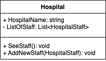
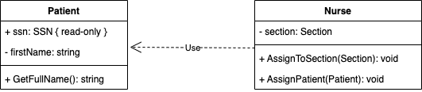
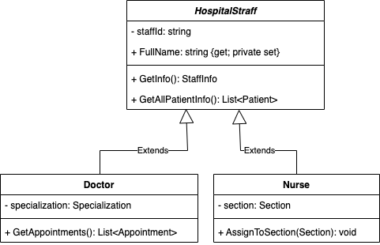
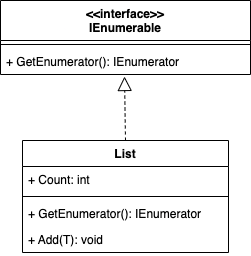

<!-- .slide: data-background="#003d73" -->

# UML

## Cohesion/Coupling

 <!-- .element style="width: 200px; position: fixed; bottom: 50px; left: 50px" -->

----

## Agenda

* Classes
* Relations
* Guidlines to design

---

## Classes

* Three compartments:
    * **class name** 
    * Attributes
    * Operations
* Private attributes
    * Reveals internal working of class
    * Breaks which Object Oriented 'rule'?

<!-- .slide: style="font-size: 36px" -->

----

### Attributes & Methods

* Attributes 
`visibility name: type multiplicity = default {property}`<!-- .element: style="font-size: 30px" -->
* Operations:  
`visibility name (parameter-list): return-type {property}`<!-- .element: style="font-size: 30px" -->
    * Normally methods

----

## Types of classes

* Abstract class/method (*italic*)
    * Cannot create instance of these
* Interface (annotated)
    * Only specification

---

## Relations

[https://dilbert.com/strip/2013-09-21](https://dilbert.com/strip/2013-09-21)

----

### Association

* *Solid line with open arrow and directed line between two objects*
* Another way to show properties
* Association over properties
    * If class are importent

<!-- .slide: style="font-size: 36px" -->

----

### Composition

* *Solid line with filled diamod - can be directed*
* Owner
* Lifecycle of object is controlled by
* We **do not** use Aggregation (open diamond)

----

### Dependency

* *Dotted line with open arrow*
* Changes in **supplier** causes changes in **client**
     * who is client? and supplier?
* Dependency is not transitive
* Minimize depencies
    * Especially between packages\*

\* Groups of classes (like a .NET project)<!-- .element: style="font-size: 26px" -->

<!-- .slide: style="font-size: 36px" -->

----

### Inheritance

* *Solid line with closed arrow*
* Extending or subclasing
* Meaning substitutability

----

### Extending Abstract class

* *Solid line with closed arrow*
* Extends abstract file
* Must override abstract methods

----

### Implementation

* *Dotted line with closed arrow*
* Interface specifies un-implemented methods
* Sub-classes can have extra methods

---

##  Design Principles

----

### Cohesion

We want <mark>high</mark> cohesion because
* classes/objects is easier to maintain if
    * data/behavior is related
* smaller objects
* easier to reuse

----

### Coupling

* We want <mark>low</mark> coupling because
    * avoid effect riples through 
* High coupling typically means
    * its <mark>hard</mark> to make change / add features

----

#### How to keep coupling low

* Only depended on abstraction
    * e.g interfaces
    * encapsulations
* Not on implementation

----

## References

* [Coupling/Cohesion](https://dev.to/mgce/do-you-know-grasp-part-3-cohesion-and-coupling-45ia)