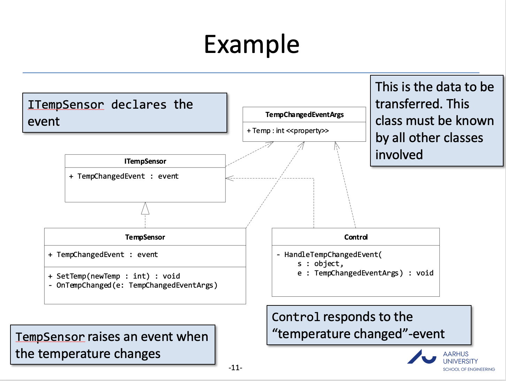
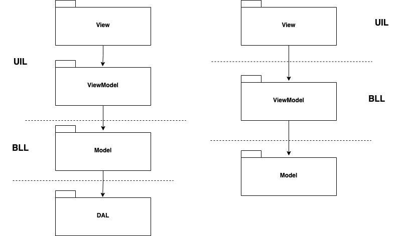
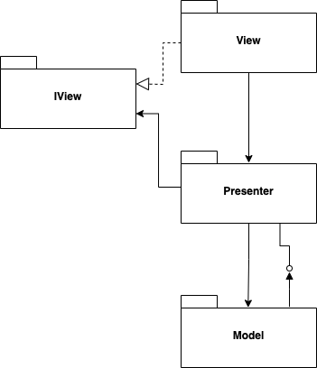

<!-- .slide: data-background="#003d73" -->

## MVVM

### Model-View-ViewModel


 <!-- .element style="width: 200px; position: fixed; bottom: 50px; left: 50px" -->

----

## Agenda

* Last week
* Problem
* MVVM
* Other GUI Patterns

---

### Solution from last week

----



---

## Good to know


----

### LINQ

```csharp
var startingPlayers = _roaster.Players
    .Where(player => player.Starter)
    .Select(player => 
            new PlayerviewModel(player.Name, player.Number))
// Same as
List<PlayerviewModel> playerviewModels =
                    new List<PlayerviewModel>();
foreach (var player in _roaster.Players) {
    if (player.Starter) {
        var pvm = new PlayerviewModel(player.Name, player.Number);
        playerviewModels.Add(pvm);
    }
}
```

----

### Lambda

```
(parameter) => method body
```

e.g.

```csharp
private Func<Player, bool> _starterSelector =
                player => player.Starter;
// Or 
private Func<int, int, int> _sum = ((i1, i2) => i1 + i2);
```

----

### `Where` and `Select`

* `Where(IEnumarable<TSource> source, Func<TSource, bool> predicate)`
    * Returns a list which only contains the elements where predicate is true
* `Select(IEnumarable<TScource> source, Func<TSource, TResult> selector)`
    * Returns a list, where each element is transformed with selector

Note:

```csharp
List<int> ints = new List<int>() {1, 2, 3, 4, 5, 6, 7, 8, 9, 10};
var even = ints.Where(i => i % 2 == 0);
// even = [2, 4, 6, 8, 10]

var timesTwo = ints.Select(i => i * 2);
// timesTwo = [2, 4, 6, 8, 10, 12, 14, 16, 18, 20]
```

----

### Lambda and LINQ

We will come back to this in a later lecture.

----

### `ListBox`

[ListBox](https://learn.microsoft.com/en-us/dotnet/api/system.windows.controls.listbox?view=windowsdesktop-7.0&viewFallbackFrom=net-6.0 "ListBox")


```xml
// In XAML file
<ListBox x:Name="rightDeckListBox" Grid.Row="1" Grid.Column="1"
            Margin="10,0,10,10" ItemsSource="{DynamicResource rightDeck}" 
            KeyDown="rightDeckListBox_KeyDown" />
```

* Shows a list of selectable items in a WPF application
* Items can be static or dynamic.
    * Above examples is dynamic.

----

### `ObservableCollection<T>`

[ObservableCollection<T>](https://learn.microsoft.com/en-us/dotnet/api/system.collections.objectmodel.observablecollection-1?view=net-7.0)

* A dynamic collection like `List<T>`
* Provides notifications when the list is mutate
    * E.g. `Add`, `Remove` and `Clear` operations
* In WPF this means that bindings are automaticaly updated

---

## Problem


 <!-- .element: style="height: 400px" -->

Can we use this for both an operation and a practitioner consultation? <!-- .element: class="fragment" -->

----

### Reuse

* Hopefully we could reuse
    * Data access code
    * Business logic code
* UI Forms and controls
    * We can properly reuse the forms and controls
* What a about alarms - showing when the presure is to high or low.

note: 

Operation: sys < 180
Practitionel: 140/90

Sys: high
Dia: low


----

### Solution


We need a specific place to keep UI logic.


---

## MVVM

 <!-- .element: style="float: right; margin-right: 200px" -->

* **M**odel
* **V**iew
* **V**iew**M**odel

----

### Data flow


----

### Bindings 

* View is updated with data from ViewModel 
    * Updated through data bindings
* This can be Two-way - meaning ViewModel is updated from View
```xml
<TextBox
    Text="{Binding Path=Height, StringFormat=F1, Mode=TwoWay}"
```
* [Binding declaration](https://learn.microsoft.com/en-us/dotnet/desktop/wpf/data/binding-declarations-overview)

----

### Commands

* Communication from View to ViewModel
* ICommand interface exists in .NET
    * `Execute(object)` called when command is actuated 
    * `CanExecute(object)` returns boolen and determines if UI 'unluck' command
    * `CanExecuteChanged` should be raised when 'CanExecute` should be reevaluated
* RelayCommand is an implementation of this interface
```xml
<Button 
    Command="{Binding CalcBMICommand, Mode=OneTime}"/>
```

<!-- .slide: style="font-size: 34px" -->

---

#### Model in C#

BMI calculator

```csharp
public class BMIModel
{
    public double Weight { set; get; }

    public double Height { set; get; }

    public double CalculateBMI()
    {
        return Weight / (Height * Height);
    }
}
```

----

#### DataContext in C#

Creating a ViewModel 

```csharp
public class BMIViewModel : INotifyPropertyChanged {
}
```

Defining a DataContext

```xaml [3-5]
<Window x:Class="BMICalculator.MainWindow"
        ...>
    <Window.DataContext>
        <local:BMIViewModel/>
    </Window.DataContext>
    ...
</Window>
```

----

#### ViewModel in C# 

INotifyPropertyChanged implementation

```csharp [3, 5-13]
public class BMIViewModel : INotifyPropertyChanged {
    ...
    public event PropertyChangedEventHandler PropertyChanged;

    private void NotifyPropertyChanged(
        [CallerMemberName] string propertyName = null) {
        var handler = PropertyChanged;
        if (handler != null)
        {
            handler(this, 
                new PropertyChangedEventArgs(propertyName));
        }
    }
}
```

----

#### ViewModel Binding

Properties

```csharp [3-12]
public class BMIViewModel : INotifyPropertyChanged {
    BMIModel bmiModel = new BMIModel();
    public double Height {
        get { return bmiModel.Height; }
        set {
            if (value != bmiModel.Height)
            {
                bmiModel.Height = value;
                NotifyPropertyChanged();
            }
        }
    }
    ...
}
```

----

#### ViewModel Read-Only

Read-only property

```csharp [3-6, 10-11]
public class BMIViewModel : INotifyPropertyChanged {
    ...
    double bmi;
    public double BMI {
        get { return bmi; }
    }

    private void CalcBMI()
    {
        bmi = bmiModel.CalculateBMI();
        NotifyPropertyChanged("BMI");
    }
    ...
}
```

----

#### Bingings in XAML

Input data

```xaml [4,7]
<Window ..>
    ...
    <TextBox ...
        Text="{Binding Path=Weight, StringFormat=F1}" />
    ...
    <TextBox ...
        Text="{Binding BMI, Mode=OneWay, StringFormat=F1}" />
    ...
</Windows>
```

----

#### ViewModel in C# 

Relay commands

```csharp [4-8]
public class BMIViewModel : INotifyPropertyChanged {
    ...
    ICommand _calcBMICommand;
    public ICommand CalcBMICommand {
        get { return _calcBMICommand ??
            (_calcBMICommand = new RelayCommand(CalcBMI,
                                 CalcBMICanExecute)); }
    }
    private bool CalcBMICanExecute() {
        if (Weight != 0.0 && Height != 0.0)
            return true;
        else
            return false;
    }
    ...
}
```

----

#### Commands in XAML

Executing commands

```xaml [3-5]
<Window ..>
    ...
    <Button ...
        Command="{Binding CalcBMICommand, Mode=OneTime}"
        />
    ...
</Windows>
```

---

## MVVM and 3-layers achitecture




----

## Other GUI Patterns

----

### MVC


* **M**ode-**V**iew-**C**ontroller
* Properly the most cited UI pattern
    * Most wrongly cited pattern
* Used when there are a clear seperations between control and view

----

### MVC 

 <!-- .element: style="height: 500px" -->

----

### MVP



----

#### MVP

* **M**ode-**V**iew-**P**resenter
* Used for the same things as MVVM
    * introduced before bindings
    * still used in frameworks without view-bindings.


---

## References

* [UI changes](https://xkcd.com/1770/)
* [BMI calcalator by Poul Ejnar Rovsing](https://pure.au.dk/portal/en/persons/poul-ejnar-rovsing(252c9404-1c55-4a92-bd0c-97a201cd414a).html)
* [GUI Architectures](https://www.martinfowler.com/eaaDev/uiArchs.html)