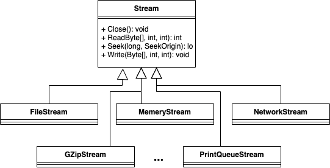

<!-- .slide: data-background="#003d73" -->

## Files

### Streams

 <!-- .element style="width: 200px; position: fixed; bottom: 50px; left: 50px" -->


----

### Agenda

* Files
* Streams
* Encoding
* Serilization

---

## Files in C# <!-- .element: style="color:#003d73; background-color: #ffffff" -->

<!-- .slide: data-background-image="./img/files.jpeg" -->

----

### File

"Provides static methods for the creation, copying, deletion, moving, and opening of a single file, and aids in the creation of FileStream objects."

*Remember the `static` keyword?*

----

### File methods


* [Read|Write]AllLines
* [Read|Write]AllText
* Open[Read|Write|Text]
* Create[Write]
* [Complete List](https://learn.microsoft.com/en-us/dotnet/api/system.io.file?view=net-6.0#methods)

----

### Directory methods

* CreateDirectory
* Delete
* Exist
* Enumerate[Files|Directories]
* [Complete List](https://learn.microsoft.com/en-us/dotnet/api/system.io.directory?view=net-6.0#methods)


----

### Soybean Incubator


----

### The acutal system

 <!-- .element: style="height: 600px" -->

----

### Data

```txt
time,t1,time_t1,t2,time_t2,t3,time_t3,average_temperature,heater_on,fan_on,execution_interval,elapsed
1614859007119846022,20.937,1614859005360261879,23.437,1614859006240283419,23.312,1614859007119842744,23.3745,False,True,3,2.6085093021392822
1614859010160238574,20.937,1614859008400317992,23.437,1614859009280255885,23.25,1614859010160233463,23.3435,False,True,3,2.6484806537628174
```

----

### Stunt code <!-- .element: style="color:#003d73; background-color: #ffffff" -->

<!-- .slide: data-background-image="https://lh5.googleusercontent.com/-Ux8GveYkSeM/TXjtNB_06tI/AAAAAAAAAoE/vt_gCiXGuVE/s1600/MOTION+FLYING+WOMAN.jpg" -->

Note:

Remember: 
- Static
- Paths (absolute, relative or copy)
- String.Split

----

### Your turn <!-- .element: style="color:#003d73; background-color: #ffffff" -->

Work on exercises 1-3<br/>
Continue on optional exercises <!-- .element: style="color:#000000; background-color: #ffffff" -->

<!-- .slide: data-background-image="./img/your_turn.png" -->

---

## Streams



----

### Streams and Reader/Writer

* Generic way to work with sequences of bytes (come to this later)
    * Specific for Files, Network, ...
* Reader/Writer - reads/writes specific types of data
    * Stream, String, Binary, ...

----

### `StreamWriter.Write()`

* `Write` can write simple types to a stream
    * `int`, `double`, `string`, ...


```cs[3|4|8]
public static void WriteNumbersToStreams(string filename)
{
    FileStream fs = new FileStream(filename, FileMode.Create);
    StreamWriter streamWriter = new StreamWriter(fs);

    for (int i = 0; i < 100; i++)
    {
        streamWriter.Write(i);
    }
    
    streamWriter.Close();
}
```


----

### `StreamWriter.WriteLine()`

* `WriteLine` works like `Console.WriteLine`

```cs[8]
public static void WriteLinesToStream(string filename)
{
    FileStream fs = new FileStream(filename, FileMode.Create);
    StreamWriter streamWriter = new StreamWriter(fs);

    for (int i = 0; i < 100; i++)
    {
        streamWriter.WriteLine($"Number is {i}");
    }
    
    streamWriter.Close();
}
```

----

### Chaining Streams

* Data can flow through multiple steams

```cs[3-5]
public static void WriteZippedToStreams(string filename)
{
    FileStream fs = new FileStream(filename, FileMode.Create);
    var gZipStream = new GZipStream(fs, CompressionLevel.Fastest);
    StreamWriter streamWriter = new StreamWriter(gZipStream);
    for (int i = 0; i < 100; i++)
    {
        streamWriter.Write(i);
    }    
    streamWriter.Close();
}
```
* Data flows through `GZipStream` -> `FileStream`
* Can be read back with `GZipStream.Read()` or [`gzip`](https://sourceforge.net/projects/gzip-for-windows/)

Note:

```shell
% gunzip ExampleApplications/bin/Debug/net6.0/test.txt.gz  
ExampleApplications/bin/Debug/net6.0/test.txt already exists -- do you wish to overwrite (y or n)? y
% less ExampleApplications/bin/Debug/net6.0/test.txt
```


----

### `StreamWriter.ReadLine()`

* `ReadLine` reads file line by line
* `Read` reads 1...n bytes

```cs[3|4|6|8]
public static void ReadLinesFromStream(string filename)
{
    var fs = new FileStream(filename, FileMode.Open);
    var streamReader = new StreamReader(fs);

    while (!streamReader.EndOfStream)
    {
        string? line = streamReader.ReadLine();
        Console.WriteLine(line);
    }
    streamReader.Close();
}
```

----

### Binary

* Computers works with binary representation of data
* BinaryWriter (and Reader) can write binary data

```cs
    public static void WriteBinaryToFile(string filename)
    {
        FileStream fs = new FileStream(filename, FileMode.Create);
        var binaryWriter = new BinaryWriter(fs);

        binaryWriter.Write("Hello World!");
        binaryWriter.Write(42);
        binaryWriter.Write('H');
        
        binaryWriter.Close();
    }
```

----

### `hexdump`

* First 'block' is the offset
* Rest is data - split in `16 bytes` segments 
```
% hexdump ExampleApplications/bin/Debug/net6.0/test.bin
0000000 480c 6c65 6f6c 5720 726f 646c 2a21 0000
0000010 4800                                   
0000012
```

----

### Building a HexDump in C#

```csharp [1|2|4]
using (var reader = new StreamReder("textdata.txt")) {
    while (!reader.EndOfStream) {
        var buffer = new char[16];
        var bytesRead = reader.ReadBlock(buffer, 0, 16);
        ...
    }
}
```

note:

- using() - awailable on some classe - used to help us (developers) clean up after our self.
- EndOfStream: flag that signifies if stream is at the end.
- ReadBlock: blocking version of Read - meaning that it blocks (does not continue) until we are read count bytes or are at end of stream

----

### Data manipulation

```csharp
var buffer = new char[16];
var bytesRead = reader.ReadBlock(buffer, 0, 16);
...
Console.Write("{0:x2}", (byte) buffer[i]);
...
var bufferContent = new string(buffer);
bufferContent.Substring, 0, bytesRead);
```

note:
- `"{0:x2}"`: Format (`{<interpolationExpression>[,<alignment>][:<formatString>]}`). :x2 is hex and 2 char long
- cast `(byte)`: buffer contains char, but we need the byte value, so we can convert char to byte - by casting.
- Substring": Returns part of the string, from and length har given.

----

### Your turn <!-- .element: style="color:#003d73; background-color: #ffffff" -->

Work on exercises 4-5<br/>
Continue on optional exercises  <!-- .element: style="color:#000000; background-color: #ffffff" -->

<!-- .slide: data-background-image="./img/your_turn.png" -->

---

## Serilization

* Convert a structure into a series of bytes
* Flatten e.g. an object to some data. 

```cs
class Patient {
    public string Name { get; set; }
    public int BirthYear { get; set;}
    ...
    public int CalculateAge() ...
    ...
}
```

* byte array containing the data fields in the object.


----

### JSON

* Industry standard format for transfering data
* Contains meta data about content.
* Simple and fairly easy to read (once you get use to it)
```js
{
    Name: "Lars Larsen",
    BirthYear: 1948,
    ...
}
```

----

### `JsonSerializer.Serialize()`

```cs
public static string SerializeAsJSon(object obj)
{
    return JsonSerializer.Serialize(obj);
}
```

outputs

```
{"FirstName":"Lars","LastName":"Larsen",
 "BirthDate":"2023-01-13T11:08:52.271477+01:00","Status":1}
```

----

### Other formats

* XML
* YAML
* and many many more


---

<!-- Encoding -->

* Encoding is the process of translating text to bytes <!-- .element: style="width: 600px" -->
* Size of binary output depends on encoding <!-- .element: style="width: 600px" -->
    * but also available charecters <!-- .element: style="width: 600px" -->
* Your machine (and every other) has a default/set encoding <!-- .element: style="width: 600px" -->
    * e.g. `System.Text.UTF8Encoding ` <!-- .element: style="width: 600px" -->

<!-- .slide: data-background-image="./img/encoding.png" -->

----

### In C#

* C# supports many [encodings](https://learn.microsoft.com/en-us/dotnet/api/system.text.encoding?view=net-7.0#list-of-encodings)
* But there are a couple of encodings we use more than other
    * ASCII
    * UTF8/32
    * Unicode


----

###

```cs
public static byte[] ConvertToUtf8(string text)
{
        // var utf8Encoding = new UTF8Encoding();
        // utf8Encoding.GetBytes(text);
        return Encoding.UTF8.GetBytes(text);
}
```
* `Encoding.UTF8` returns a default encoder
* `UTF8Encoding` is basicly the same, but offers ways to customize it.


----

### Importent to be consistent

  <!-- .element: class="fragment" data-fragment-index="1" style="position: absolute; top: 50%; right: 5%; width: 250px; " -->

```cs
byte[] bytes = Encodings.ConvertToUtf8("Hello world!");
string unicode = Encodings.ConvertFromUnicode(bytes);

Console.WriteLine(unicode);
```

outputs

 <!-- .element: style="width: 150px;" -->

----

### Your turn <!-- .element: style="color:#003d73; background-color: #ffffff" -->

Continue with exercises <!-- .element: style="color:#000000; background-color: #ffffff" -->

<!-- .slide: data-background-image="./img/your_turn.png" -->

---

## References

* [XKCD: Standards](https://xkcd.com/927/)
* [Incubator](https://github.com/INTO-CPS-Association/example-incubator)


