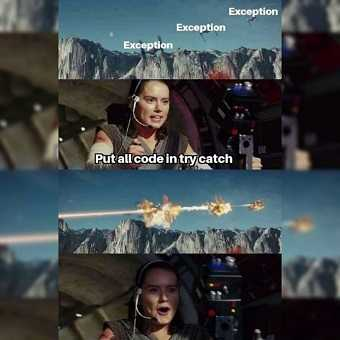

<!-- .slide: data-background="#003d73" -->

## Exceptions

### Debugging

 <!-- .element style="width: 200px; position: fixed; bottom: 50px; left: 50px" -->


 <!-- .element: style="width: 500px;"  -->


----

### Agenda


* What are exceptions<br/><!-- .element: class="fragment"  -->
* Handling exceptions<br/><!-- .element: class="fragment" -->
* When to use exceptions<br/><!-- .element: class="fragment" -->
* Defining exceptions<br/><!-- .element: class="fragment" -->

---

### Why

* Avoid testing for every little thing in our code<br/><!-- .element: class="fragment" -->
* Still unexpected events will happen<br/><!-- .element: class="fragment" -->
* Exceptions forces us to handle errors<br/><!-- .element: class="fragment" -->

----

#### E.g. Testing everything with files

* File exists<br/><!-- .element: class="fragment" -->
* Is readable/writable<br/><!-- .element: class="fragment" -->
* Contains the correct data<br/><!-- .element: class="fragment" -->
* Has not changed after we tested it<br/><!-- .element: class="fragment" -->
    * not on windows

----

#### Data input

* Is it available<br/><!-- .element: class="fragment" -->
* Correct format<br/><!-- .element: class="fragment" -->
* Not illegal values?<br/><!-- .element: class="fragment" -->

---

<!-- .slide: style="font-size: 36px" -->
### What

When unexcpected (exceptions) happens in an application. A special object is created and thrown<br/><!-- .element: class="fragment" -->

* Exception is a special class in .NET<br/><!-- .element: class="fragment" -->
    * also classes derived from Exception
* CLR (Common Language Runtim&#x1F41E;) populate state for these objects<br/><!-- .element: class="fragment" -->
* Common state for all exceptions<br/><!-- .element: class="fragment" -->
    * Message
    * StackTrace
    * InnerException
    * ...

----

### Throw

* Throwing an exception object <br/><!-- .element: class="fragment" -->
* <!-- .element: class="fragment" --> Means that any statement after the exception is <mark>thrown</mark> is ignored

----

### `NullReferenceException`

```
Unhandled exception. System.NullReferenceException:
         Object reference not set to an instance of an object.
   at ExceptionExamples.Faulty.IsLastString() in
        /ST2ITS2_Material/source/Exception/ExceptionExamples/Faulty.cs:line 25
   at ExceptionExamples.Faulty.GetShortestString() in 
        /ST2ITS2_Material/source/Exception/ExceptionExamples/Faulty.cs:line 10
   at Program.<Main>$(String[] args) in 
        /ST2ITS2_Material/source/Exception/ExceptionExamples/Program.cs:line 8
```
<!-- .element: style="font-size: 18px;" -->


----

### `FileNotFoundException`

```
Unhandled exception. System.IO.FileNotFoundException: Could not find file '/ST2ITS2_Material/source/Exception/ExceptionExamples/bin/Debug/net6.0/NoExistingFile.txt'.
File name: '/ST2ITS2_Material/source/Exception/ExceptionExamples/bin/Debug/net6.0/NoExistingFile.txt'
   at Interop.ThrowExceptionForIoErrno(ErrorInfo errorInfo, String path, Boolean isDirectory, Func`2 errorRewriter)
   at Microsoft.Win32.SafeHandles.SafeFileHandle.Open(String path, OpenFlags flags, Int32 mode)
   at Microsoft.Win32.SafeHandles.SafeFileHandle.Open(String fullPath, FileMode mode, FileAccess access, FileShare share, FileOptions options, Int64 preallocationSize)
   at System.IO.Strategies.OSFileStreamStrategy..ctor(String path, FileMode mode, FileAccess access, FileShare share, FileOptions options, Int64 preallocationSize)
   at System.IO.Strategies.FileStreamHelpers.ChooseStrategy(FileStream fileStream, String path, FileMode mode, FileAccess access, FileShare share, Int32 bufferSize, FileOptions options, Int64 preallocationSize)
   at System.IO.StreamReader.ValidateArgsAndOpenPath(String path, Encoding encoding, Int32 bufferSize)
   at System.IO.File.InternalReadAllLines(String path, Encoding encoding)
   at System.IO.File.ReadAllLines(String path)
   at ExceptionExamples.Faulty.ReadFileIntoString(String name) in /ST2ITS2_Material/source/Exception/ExceptionExamples/Faulty.cs:line 48
   at Program.<Main>$(String[] args) in /ST2ITS2_Material/source/Exception/ExceptionExamples/Program.cs:line 9
```
<!-- .element: style="font-size: 14px;" -->

```
Unhandled exception. System.IO.FileNotFoundException: Could not find file '/ST2ITS2_Material/source/Exception/ExceptionExamples/bin/Debug/net6.0/NoExistingFile.txt'.
File name: '/ST2ITS2_Material/source/Exception/ExceptionExamples/bin/Debug/net6.0/NoExistingFile.txt'
   at 
   ...
   at System.IO.File.ReadAllLines(String path)
   at ExceptionExamples.Faulty.ReadFileIntoString(String name) in 
        /ST2ITS2_Material/source/Exception/ExceptionExamples/Faulty.cs:line 48
   at Program.<Main>$(String[] args) in 
        /ST2ITS2_Material/source/Exception/ExceptionExamples/Program.cs:line 9
```
<!-- .element: style="font-size: 18px;" class="fragment" -->


---

### How

* Just let errors happen<br/><!-- .element: class="fragment" -->
    * &#x25B6; handle somewhere else

 <!-- .element: style="width: 500px" class="fragment" -->


----

### Handling errors

```csharp [1,2,4,5,8]
try
{
    faulty.ReadFileIntoString("NoExistingFile.txt");
} catch (FileNotFoundException e)
{
    Console.Error.WriteLine($"File '{e.FileName}' do not exists");
    Console.Error.WriteLine(e.Message);
}
```

----

### Multiple exceptions types

* Allowed to catch different exceptions<br/><!-- .element: class="fragment" -->
* Possibility to handle different errors in specific ways<br/><!-- .element: class="fragment" -->

```csharp [1, 5, 9]
try
{
    faulty.ReadFileIntoString("NotExistingFile.txt");
}
catch (FileNotFoundException e)
{
    Console.Error.WriteLine($"File '{e.FileName}' do not exists");
}
catch (ArgumentException)
{
    Console.Error.WriteLine("Filename supplied is empty, retry");
}
```
<!-- .element: class="fragment" -->

----



----

### Catch all

```csharp [2, 5, 8]
var filename = "NoExistingFile.txt";
try
{
    faulty.ReadFileIntoString(filename);
} catch (Exception e)
{
    Console.Error.WriteLine($"File '{filename}' do not exists");
    Console.Error.WriteLine(e.Message);
}
```

----

### Finally

* Force execution of code even when an error occur

```csharp [1,4,9-13]
MemoryStream stream = null;
try
{
    stream = new MemoryStream();
    faulty.ReadFileIntoString("NotExistingFile.txt");
}
catch (FileNotFoundException e) { // TODO handle
}
finally
{
    if (stream != null)
        stream.Close();
}
```

note:

* Need to close stream to avoid memory leak
* Syntactical sugar
```csharp
stream?.Close();
```

----

### Cannot handle error here

```csharp
MemoryStream? stream = null;
try
{
    stream = new MemoryStream();
    faulty.ReadFileIntoString("NotExistingFile.txt");
}
finally
{
        stream?.Dispose();
}
```

note:

* This is the same as using
* Syntatic sugar in code


---

### When

* No errors in constructor<br/><!-- .element: class="fragment" -->
* Catch exceptions as close to where they are thrown<br/><!-- .element: class="fragment" -->
* If you can't handle exception<br/><!-- .element: class="fragment" -->
    * log and then rethrow
    * never 'swallow' exception (empty catch clause)

 <!-- .element: style="width: 300px" class="fragment" -->

----

### Empty catch block

* <!-- .element: class="fragment" -->Do **not** leave catch block empty, even when developing<br/>
    * It will stay empty
```csharp
try
{
    TestEnoughCoffee();
} catch (NoCoffeeException)
{}
```
* As a minimum put in a log message (or WriteLine)<br/><!-- .element: class="fragment" -->


----

### Re-throw

* May want to log (or simular) close to the origin of error<br/><!-- .element: class="fragment" -->
    * But can't actually handle error at this point

```csharp [7,8]
try
{
    TestEnoughCoffee();
}
catch (NoCoffeeException)
{
    Console.Error.WriteLine("Cant handle coffee problems here");
    throw;
}
```
<!-- .element: class="fragment" -->

---

### Creating Exceptions

* Extend Exception<br/><!-- .element: class="fragment" -->
    * or one of the other existing exception classes

```csharp [1,11-12]
public class NoCoffeeException : Exception
{
    public int Expected { get; private set; }
    public NoCoffeeException(string message, int expected)
     : base(message)
    {
        Expected = expected;
    }
}

// somewhere else throw this
throw new NoCoffeeException("No coffee given", 30);
```
<!-- .element: class="fragment" -->

----

### Nest exceptions

* Exception can be nested to add more context to an error

```csharp [7-9]
try
{
    TestEnoughCoffee();
}
catch (NoCoffeeException e)
{
    throw ArgumentException(
        "Argument given failed in coffee making",
         e);
}
```


---

### References

As they appear

* `InvalidCastException`
* `FormatException`
* `OverflowException`
* `DivideByZeroException`
* `NullReferenceException`
* `Exception`
* `IndexOutOfRangeException`
* `UnauthorizedAccessException`
* `ArgumentException`

----

### Links

* [Front page comic](https://simply-the-test.blogspot.com/2015/07/)