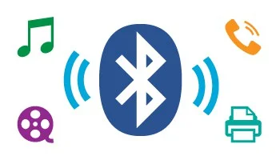

<!-- .slide: data-background="#003d73" -->

## Interfaces

### Polymorphism

 <!-- .element style="width: 200px; position: fixed; bottom: 50px; left: 50px" -->


----

### Agenda

* Interface
    * What are interfaces
    * Interfaces as a type
    * Inheritance vs implementation
* Casting
* interfaces + interfaces
* Object
* Nullable

---

### Remember abstract classes?

* Able to define methods
    * some left **un**implemented
* Possible to reuse code and make it custom

```csharp
public abstract class Child {
    public abstract void Play();
    public void Eat() {
        // implementation
    }
}
public class Girl : Child {
    public override void Play() {
        // implementation
    }
}
```

----

### Abstract class in UML 

```language-plantuml
@startuml

skinparam classAttributeIconSize 0


Child <|-- Girl


abstract class Child {
  +{abstract} Play():void 
  + Eat():void
}

class Girl {
  + Play(): void
}

@enduml
```

----

## Interfaces

* What if all methods should be abstract?
    * meaning only defining the interface

  <!-- .element: style="width: 300px; float: left; margin-left: 100px" class="fragment" -->

 <!-- .element: style="width: 300px; float: right; margin-right: 100px" class="fragment" -->

----

## Interfaces is excatly that

* Special class with **no** data and **only** abstract methods

```csharp
public interface IPoint {
    int X {get; set;}
    int Y {get; set;}
    double Distance(Point to);
}
```

* Name starts with an <mark>I</mark> (uppercase i)
* Pascal Case in addition to that
    * Upper case begining word + including first

----

## Implementing an interface

```csharp
public interface IPoint {
    int X {get; set;}
    int Y {get; set;}
    double Distance(IPoint to);
}

public class Point : IPoint {
    public int X {get; set;}
    public int Y {get; set;}
    public double Distance(IPoint to) {
        return 0.0;
    }
}
```

* *Note* methods/properties are public by default

----

# In UML

```language-plantuml
@startuml

skinparam classAttributeIconSize 0


IPoint <|.. Point


interface IPoint {
   + X : int {get; set;}
   + Y : int {get; set;}
   + Distance(IPoint): double
}

class Point {
   + X : int {get; set;}
   + Y : int {get; set;}
   + Distance(IPoint): double
}

@enduml
```

----

## Polymorphism

```csharp
IPoint point = new Point();
IPoint point2 = new Point();
point.Distance(point2);
//
List<IPoint> points = new List<IPoint>();
```

* `IPoint` can reference `Point` or any other class <mark>implementing</mark> the interface `IPoint`

----

## Why interfaces

1. A class can implement <mark>multiple</mark> interfaces
    * but only <mark>one</mark> class
1. Abstract classes tends include implementation
    * interface is only a specification
        * changed in C# 8.0 - but **not** covered
1. Interfaces is a <mark>type</mark>
    * code towards an interface
1. Specification is often used between teams
    * each team adheres to a defined interface

----

### Interface

```csharp
interface IPrintable {
    void Print();
}
public class Point : IPoint, IPrintable {
    public int X {get; set;}
    public int Y {get; set;}
    public double Distance(Point to) {
        return 0.0;
    }
    public void Print() {
        // Print 
    }
}
```

* If class also <mark>inherits</mark> from a class - then class is first
    * `public class Point: Object, IPoint, IPrintable`

----

```language-plantuml
@startuml

skinparam classAttributeIconSize 0


IPoint <|.. Point
IPrintable <|.. Point

interface IPrintable {
   + Print(): void
}

interface IPoint {
   + X : int {get; set;}
   + Y : int {get; set;}
   + Distance(IPoint): double
}

class Point {
   + X : int {get; set;}
   + Y : int {get; set;}
   + Distance(IPoint): double
   + Print(): void
}

@enduml
```

---

## interfaces extending interfaces

* Interfaces can extend interfaces
* Same as with classes, one interface can extend multiple interfaces
```csharp
interface IArea {
	double Area();
}
interface ICircumreference {
	double Circumreference();
}
interface IShape: IArea, ICircumreference {}
```

----

### Abstract class and interfaces

* Abstract class do not need to implement interface methods
```csharp
public abstract class Shape: IArea, ICircumreference {
	public abstract double Area();
	public abstract double Circumreference();
}
// or
public abstract class Shape: IShape {
	public abstract double Area();
	public abstract double Circumreference();
}
```

----

### Your turn <!-- .element: style="color:#003d73; background-color: #ffffff" -->

Work on starter exercises<br/>  <!-- .element: style="color:#000000; background-color: #ffffff" -->

Continue on Shapes exercises  <!-- .element: style="color:#000000; background-color: #ffffff" -->

<!-- .slide: data-background-image="../img/your_turn.png" -->

---

## Casting

* Casting means converting an object from one type to another
* This can be done in a couple of ways
* First lets look at the <mark>safe</mark> way of casting
```csharp
object obj = "Hello I'm a String";
if (obj is string str) {
    Console.WriteLine(str.ToLower());
}
```
* Here we cast an object to a string

----

## Alternative casting
### Unsafe

```csharp
Shape shape = new Circle(); // when can we do this?

Circle? cirle = shape as Circle; // 1 
var circle = (Circle) shape; // 2
```

1. '`as`' casts shape to a circle if possible, otherwise null
2. '`(Type)`' cast the shape to a cicle, or throw an exception

----

## Nullable

* Represent the underlaying value or null, meaning
    * `bool?` is either `true`, `false`, and `null`
* Helps us avoid mistakes in our code
```csharp
int? value = 10
if (value is int v) {}
if (value.HasValue) {
    Console.WriteLine($"{value.Value}")
}
if (value != null) {}
int v = value ?? -1
```

---

## Object


----

### ToString

```csharp
public virtual string? ToString()
```

This can be overridden in our classes

```csharp
public class Student {
    public override string ToString() {
        return $"Student: AuID: {AuID}, " +
            "Name: {FirstName} {LastName}";
    }
}
```

Will automatically be used when object is transformed to a string


----

### GetType

```csharp
public extern Type GetType();
```

* `GetType` method returns information about the current objects type
* `Type` type holds <mark>runtime</mark> information about the object
* `extern` means that the method is defined elsewhere - performance reasons

----

### `Equals`

```csharp
public virtual bool Equals(object? obj)
```
* Used to compare if objects are equal
* On numerical types `Equals` and `==` operator works as expected
* In general if not overriden it will not work as `==` but
    * will test for <mark>reference equality</mark>

```csharp
Point p1 = new Point(1,1);
Point p2 = new Point(1,1);
Point p3 = p1;
Console.Writeline(p1.Equals(p2)) // will print false
Console.Writeline(p1.Equals(p3)) // will print true
```

----

### Override `Equals`

* This can be done to make `Equals()` behave more like you would expect

```csharp [2|3|4-5|9|1-10]
public override bool Equals(object? obj) {
    if (obj == null) return false;
    if (this == obj) return true;
    return obj.GetType() == this.GetType() 
        && Equals((Vector) obj);
}

public bool Equals(Point p) {
    return this.X.Equals(p.X) && this.Y.Equals(p.Y);
}
```

----

### 'Secret' use of `Equals`

* Overriden `Equals()` can be very usefull and important
```csharp
List<Points> points = new List<Point>();
list.Remove(p2);
```
* Remove the first element where `Equals()` return true
* Same with `Contains()`, `IndexOf()`
    * basicly all methods taking a object of [`T` as argument](https://learn.microsoft.com/en-us/dotnet/api/system.collections.generic.list-1?view=net-8.0)

----

### `GetHashCode`

```csharp
public virtual int GetHashCode()
```
* `GetHashCode()` also have hidden usage as with `Equals()`
* Generates an aggregate integer from the object
    * Default is an hash code based on the memory location
* This means different instances of an object will in general have same hash code

----

### Rules for overriding `GetHashCode`

* For mutable reference types (classes)
    1. compute based on immutable fields (not changing)
    1. or ensure that hash code don't change while contained in a collection

----

### Rules for overriding `GetHashCode`

* If two objects are equal that should have same hash code
* Should consistently return same hash code - while not being modified
* Distribute hash code evenly
* Be 'cheap' to compute
* Not throw exceptions

----

### Overriding `GetHashCode()`

* Easy to implement with [`HashCode`](https://learn.microsoft.com/en-us/dotnet/api/system.hashcode?view=net-8.0) struct
```csharp
public class Point {
    public override int GetHashCode() {
        return HashCode.Combine(X, Y);
    }
}
```
* Used in dictionaries to store elements (we will come back to this)

---

## References

* [C# object](https://learn.microsoft.com/en-us/dotnet/api/system.object?view=net-8.0)
* [List](https://learn.microsoft.com/en-us/dotnet/api/system.collections.generic.list-1.add?view=net-8.0)
* [HashCode](https://learn.microsoft.com/en-us/dotnet/api/system.object.gethashcode?view=net-8.0)
