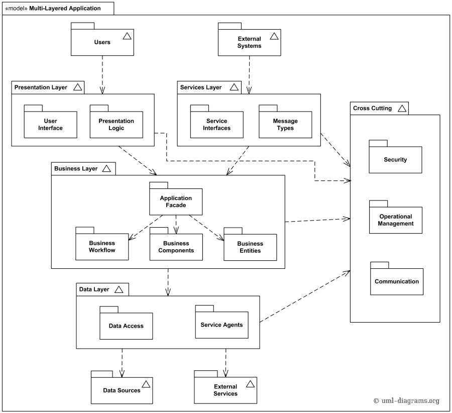
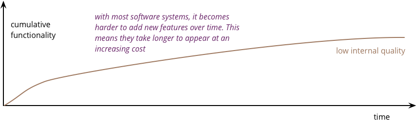
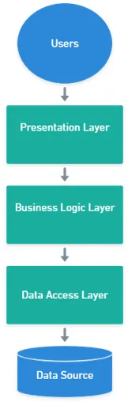
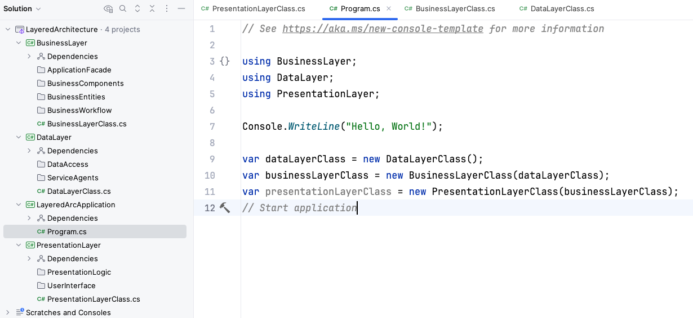

<!-- .slide: data-background="#003d73" -->

## Three layer architecure

 <!-- .element style="width: 200px; position: fixed; bottom: 50px; left: 50px" -->

----

## Agenda

* Evalution 
* Package Diagram
* Architecture
* Layers
    * in .NET

---

## UML Package diagram

----

 <!-- .element: style="height: 600px" -->

----

### Structural diagram

- Like class diagram
- Shows relation between package
    - like
        - dependencies
        - import
        - merge
        - access
    - all shown with annotaions
- Usefull when systems get bigger

----

### Package vs namespace vs projects

- Translateable to namespaces in C#
- Top-level packages translates to C# projects
    - because these normally is in the own namespace
- Namespaces within a project
    - would translate to subpackages

----

### Why

- Document of bigger projects
    - leave out the details
- First step when designing a system
    - Requirements -> ??? -> design
- Helps know where to define interfaces

---

## What is architecure

----

- No objective definition of what architure is?
    - More on this in SW4SWD (4th semester)
- "Shared understanding that the expert developers have of the system"
    - cite: Ralph Johnson
- In our context this means
    - high level view on the software structure
    - shared between all team members
    - helps split responsibility
        - both code and developer

----

----

---

## Layers

- Horizontal separation of packages
- Dependency is downwards
    - Data can flow in both directions (when you have the tools)
- Each layer having a different responsibility
- Multiple layers in _1_ executable unit

----

## 3-layer architecture

Known and battle tested

 <!-- .element: style="height: 400px" -->

----

## Layers 1

- User
    - end user (human)
    - other application (more on this in 3rd semester)
- Presentation layer (PLL)
    - contains all logic regarding presentation of data.
    - handle input / output

----

## Layers 2

- Business logic Layer (BLL)
    - application specific logic place here
    - no knowledge about how data is stored
- Data access layer (DLL)
    - handle all data sources
        - files, database (what is this??), etc.
    - optionally expose data through interfaces

----

## .NET project setup

---

## References

- [Martin Fowler on Architecture](http://martinfowler.com)
