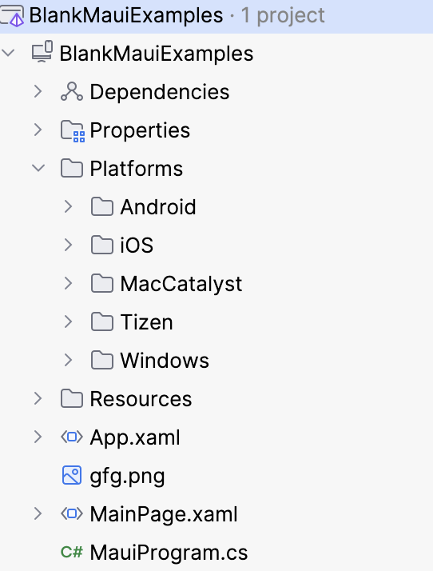

<!-- .slide: data-background="#003d73" -->

# Maui

## Introduction

 <!-- .element style="width: 200px; position: fixed; bottom: 50px; left: 50px" -->

---

## Agenda

* What is MAUI
* Creating a project
    * with all the problems :(
* Event handlers
* Controls


---

## MAUI

* Multiplatform App UI
    * Meaning you can target Android, iOS, Windows, MacOS
* Everything run on .NET
    * You write in C# (or F#, VB.NET) and XAML

----


----

### What and how

* You can write your applicatin .NET and compile to multiple platforms
    * but you need envirioment for each :(
* You can write platform specific code
    * but do not need to
* You do not need to understand how code is transformed to each platform

---

## Create a project

* [Prerequisites](https://learn.microsoft.com/en-us/dotnet/maui/get-started/installation?view=net-maui-8.0&tabs=vswin)
* [Build your first app](https://learn.microsoft.com/en-us/dotnet/maui/get-started/first-app?pivots=devices-windows&view=net-maui-8.0&tabs=vswin)
* Here you can also find information about Android, iOS
    * we focus on desktop applications

----

## Your first project looks like this

 <!-- .element: style="height: 500px" -->

----

## Your `main`

```csharp [5]
public static MauiApp CreateMauiApp()
{
    var builder = MauiApp.CreateBuilder();
    builder
        .UseMauiApp<App>()
        .ConfigureFonts(fonts =>
        {
            fonts.AddFont("OpenSans-Regular.ttf", "OpenSansRegular");
            fonts.AddFont("OpenSans-Semibold.ttf", "OpenSansSemibold");
        });
    return builder.Build();
}
```

----

## App.xaml

```xml 
<?xml version = "1.0" encoding = "UTF-8" ?>
<Application xmlns="http://schemas.microsoft.com/dotnet/2021/maui"
             xmlns:x="http://schemas.microsoft.com/winfx/2009/xaml"
             xmlns:local="clr-namespace:BlankMauiExamples"
             x:Class="BlankMauiExamples.App">
             <!--     Code behind file -->
    <Application.Resources>
        <ResourceDictionary>
            <ResourceDictionary.MergedDictionaries>
                <ResourceDictionary
                    Source="Resources/Styles/Colors.xaml" />
                <ResourceDictionary
                    Source="Resources/Styles/Styles.xaml" />
            </ResourceDictionary.MergedDictionaries>
        </ResourceDictionary>
    </Application.Resources>
</Application>
```

----

## App.xaml.cs - code-behind

```csharp [1, 3 | 9 | 1,3,9]
namespace BlankMauiExamples;

public partial class App : Application
{
    public App()
    {
        InitializeComponent();

        MainPage = new MainPage();
    }
}
```

----

### `MainPage.xaml`

```xml
<?xml version="1.0" encoding="utf-8" ?>
<ContentPage xmlns="http://schemas.microsoft.com/dotnet/2021/maui"
             xmlns:x="http://schemas.microsoft.com/winfx/2009/xaml"
             x:Class="BlankMauiExamples.MainPage">

    <ScrollView BackgroundColor="Blue">
        <VerticalStackLayout ... >

            <Image ... />

            <Label ... />

            <Label ... />

            <Button
                x:Name="CounterBtn"
                Text="Click me"
                SemanticProperties.Hint="Counts the number of times you click"
                Clicked="OnCounterClicked"
                HorizontalOptions="Center" />

        </VerticalStackLayout>
    </ScrollView>

</ContentPage>

```

----

### Vocabulary

```xml
<Button
    x:Name="CounterBtn" 
    Text="Click me"
    SemanticProperties.Hint="Counts the number of times you click"
    Clicked="OnCounterClicked"
    HorizontalOptions="Center" />
```
* **`Button`**: Control name/type
* **`x:Name`**: Name to access Control from C#
* **`Text`**: Shown text
* **SematicProperties**: Accessibility properties
* **`Clicked`**: Event handler
* **`HorizontalOptions`**: Placement

----

## `MainPage.xaml.cs`

* Again a code-behind file

```csharp
public partial class MainPage : ContentPage
{
    private void OnCounterClicked(object sender, EventArgs e)
    {
        count++;

        if (count == 1)
            CounterBtn.Text = $"Clicked {count} time";
        else
            CounterBtn.Text = $"Clicked {count} times";

        SemanticScreenReader.Announce(CounterBtn.Text);
    }
}
```

---

## Event handler


---

### Controls

---

## References

