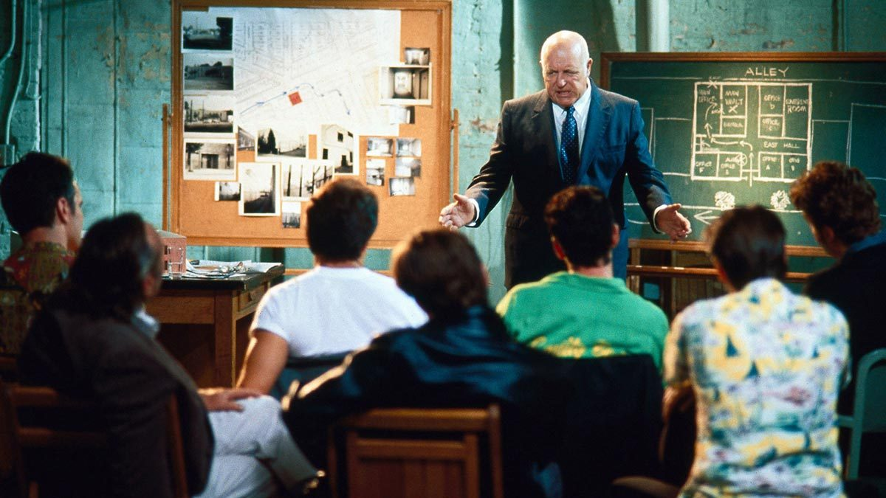

<!-- .slide: data-background="#003d73" -->

## Problem Solving

### Recap

 <!-- .element style="width: 200px; position: fixed; bottom: 50px; left: 50px" -->

---

### `You are engineers`

### `You are born to solve problems`

----

<!-- .slide: data-background-image="./img/spacexrocketreturn.jpeg" -->

----

<!-- .slide: data-background-image="./img/Pulse-Heart-Transportation-System-1.jpg" data-background-size="contain" -->

----

<!-- .slide: data-background-image="./img/h8.jpg" data-background-size="contain"  -->

----

<!-- .slide: data-background-image="./img/engineer.jpeg" data-background-size="contain" -->

---

### The plan

1. Discussion about how you would solve a new problem?
1. How could you go about solving problems
1. Solving problems and comparing solutions in groups
1. Implementaion in C# (in pairs)
1. Reflections
1. More coding

----

### Discuss

* In groups of 2 (approx 10 min)
    * How have you been given programmings exercises until now?
    * How do you solve these?

----

### Follow up

----

### Discuss

* In groups of 3 (approx 10 min)
    * How would you find a solution to a problem you haven't encountered before?

----

### Follow up on the board

---

### Technics from Think Like a Programmer

* Always have plan
* Restate the problem
* Divide the problem
* Start with what you know
* Reduce the problem
* Look at Analogies
* Experiment
* Don't get frustrated

----

### Problem examples

* Keep a container filled with water at excatly 59 degrees

* You have a course with 60 students in 20 grups
    * Each working on a choosen exercise from a list
    * Now divide students so they review a group with a different exercise
        * All students should make 2 reviews
        * Cannot review you own group or groups with same exercises

* Given a list of children - what is the most popular name among the boys and girls?

<!-- .slide: style="font-size: 32px" --->

---

#### Think - before you start to code

How to keep a container filled with a fluid at excatly 59 degrees?

 <!-- .element: style="height: 400px" -->

----

### Demo

<iframe src="https://giphy.com/embed/PlLanl8Bzcvr14IfjJ" width="480" height="270" frameBorder="0" class="giphy-embed" allowFullScreen></iframe>

----

### Your turn

Work in pairs

* How would you solve 1-5?
* **Don't** code yet
* Just figure out how you would solve the excerses?

----

### Compare

Find another group and compare your way of solving the problem?

----

### Solve exercises in C# 1-5

 <!-- .element: style="height: 500px" -->

----

### Follow up

* How did you start on the exercises?
* What worked?
* What didn't work?
* Did any of your planning work?
* Could this plan be transfered to C#?

----

### Continue 

Remember to plan first

 <!-- .element: style="height: 500px" -->

---

## References
