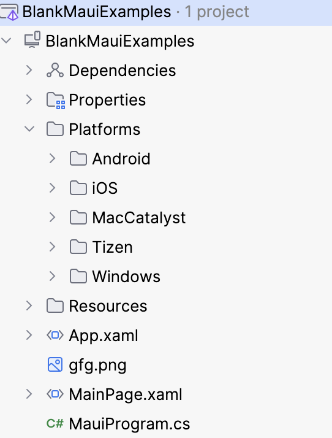

<!-- .slide: data-background="#003d73" -->

# Maui

## Introduction

 <!-- .element style="width: 200px; position: fixed; bottom: 50px; left: 50px" -->

----

## Agenda

* What is MAUI
* Creating a project
    * with all the problems :(
* Event handlers
* Running a project
* Controls + Views


---

## MAUI

* Multiplatform App UI<br/><!-- .element: class="fragment" -->
    * Meaning you can target Android, iOS, Windows, MacOS
* Everything run on .NET<br/><!-- .element: class="fragment" -->
    * You write in C# (or F#, VB.NET) and XAML

----


----

### What and how

* You can write your applicatin .NET and compile to multiple platforms<br/><!-- .element: class="fragment" -->
    * but you need environment for each :(
* You can write platform specific code<br/><!-- .element: class="fragment" -->
    * but do not need to
* You do not need to understand how code is transformed to each platform<br/><!-- .element: class="fragment" -->

---

## Create a project

* [Prerequisites](https://learn.microsoft.com/en-us/dotnet/maui/get-started/installation?view=net-maui-8.0&tabs=vswin)
    1. open Visual Studio install
    2. install MAUI develment
* [Build your first app](https://learn.microsoft.com/en-us/dotnet/maui/get-started/first-app?pivots=devices-windows&view=net-maui-8.0&tabs=vswin)
* Here you can also find information about Android, iOS
    * we focus on desktop applications
    * meaning 'maui' not 'android' or 'ios'

----

## Your first project looks like this

 <!-- .element: style="height: 500px" -->

----

## Your `main`

```csharp [5]
public static MauiApp CreateMauiApp()
{
    var builder = MauiApp.CreateBuilder();
    builder
        .UseMauiApp<App>()
        .ConfigureFonts(fonts =>
        {
            fonts.AddFont("OpenSans-Regular.ttf", "OpenSansRegular");
            fonts.AddFont("OpenSans-Semibold.ttf", "OpenSansSemibold");
        });
    return builder.Build();
}
```

----

## App.xaml

```xml [2, 7, 8, 9| 11, 13| 2-4 ]
<?xml version = "1.0" encoding = "UTF-8" ?>
<Application xmlns="http://schemas.microsoft.com/dotnet/2021/maui"
             xmlns:x="http://schemas.microsoft.com/winfx/2009/xaml"
             xmlns:local="clr-namespace:BlankMauiExamples"
             x:Class="BlankMauiExamples.App">
             <!--     Code behind file -->
    <Application.Resources>
        <ResourceDictionary>
            <ResourceDictionary.MergedDictionaries>
                <ResourceDictionary
                    Source="Resources/Styles/Colors.xaml" />
                <ResourceDictionary
                    Source="Resources/Styles/Styles.xaml" />
            </ResourceDictionary.MergedDictionaries>
        </ResourceDictionary>
    </Application.Resources>
</Application>
```

note:

XML has
- elements:
    - between '<>'
    - e.g. <Application>
    - all elements should be 'closed' with </Application>
- Attributes are allowd in elements - syntax
    - Name=value
    - e.g Source="Resources/Styles/Styles.xamls"
- Namespaces
    - xmlns: way of making reusable parts.=
- XML _must_ be well formed

----

## App.xaml.cs - code-behind

```csharp [1, 3 | 9 | 1,3,9]
namespace BlankMauiExamples;

public partial class App : Application
{
    public App()
    {
        InitializeComponent();

        MainPage = new MainPage();
    }
}
```

----

### `MainPage.xaml`

```xml [1-25|4|19]
<?xml version="1.0" encoding="utf-8" ?>
<ContentPage xmlns="http://schemas.microsoft.com/dotnet/2021/maui"
             xmlns:x="http://schemas.microsoft.com/winfx/2009/xaml"
             x:Class="BlankMauiExamples.MainPage">

    <ScrollView BackgroundColor="Blue">
        <VerticalStackLayout ... >

            <Image ... />

            <Label ... />

            <Label ... />

            <Button
                x:Name="CounterBtn"
                Text="Click me"
                SemanticProperties.Hint="Counts the number of times you click"
                Clicked="OnCounterClicked"
                HorizontalOptions="Center" />

        </VerticalStackLayout>
    </ScrollView>

</ContentPage>

```

note:

- XAML has data bindings
    - between {} 
    - or in specific attributes
        - need to learn those :()

----

### MAUI/XAML

```xml
<Button
    x:Name="CounterBtn" 
    Text="Click me"
    SemanticProperties.Hint="Counts the number of times you click"
    Clicked="OnCounterClicked"
    HorizontalOptions="Center" />
```
* **`Button`**: Control name/type
* **`x:Name`**: Name to access C# CounterBtn
* **`Text`**: Shown text
* **SematicProperties**: Accessibility properties
* **`Clicked`**: Event handler in C#
* **`HorizontalOptions`**: Placement

----

## `MainPage.xaml.cs`

* Again a code-behind file
* `ContentPage` is a fullscreen page

```csharp
public partial class MainPage : ContentPage
{
    private void OnCounterClicked(object sender, EventArgs e)
    {
        count++;

        if (count == 1)
            CounterBtn.Text = $"Clicked {count} time";
        else
            CounterBtn.Text = $"Clicked {count} times";

        SemanticScreenReader.Announce(CounterBtn.Text);
    }
}
```

---

## Event handlers

* These are special methods in C#<br/><!-- .element: class="fragment" data-fragment-index="1" -->
    * which are called when an event is triggered
* You have seen one :)<br/><!-- .element: class="fragment" data-fragment-index="2" -->

```csharp
private void OnCounterClicked(object sender, EventArgs e) {
    ...
}
```
<!-- .element: class="fragment" data-fragment-index="2" -->

----

### Event handler form

* Event handlers <br/><!-- .element: class="fragment"-->
    * normally starts with <mark>On</mark>
    * must have <mark>2</mark> parameters
        * first is sender (invoker) of the event
        * second is optional data
* Visual Studio can auto create methods from xaml file<br/><!-- .element: class="fragment"-->
* You will see the details on 3rd and 4th semester.<br/><!-- .element: class="fragment" -->

---

## Running and debugging

* Choose windows target platform<!-- .element: class="fragment" -->
<br/>
* Press Windows to build and run<br/><!-- .element: class="fragment" -->


----

### Setting developer permission

* On Windows 11: 
* Enable developer settings on windows
 <!-- .element: style="height:250px" -->
* And enable developer mode<br/>
 <!-- .element: style="height:100px" -->

---

## Controls + Views

* MAUI has 3 types of view  s
    * Pages<br/><!-- .element: class="fragment" data-fragment-index="1" -->
        * displays an app + render layouts
    * Layouts <br/><!-- .element: class="fragment" data-fragment-index="1" -->
        * can render controles
    * Controls<br/><!-- .element: class="fragment" data-fragment-index="1" -->

----

### Essential Controls

* Label - can show text
* ProgressBar - can show progress to lengthy process
* ActivityIndicator - show progress

----

### Essential Controls - input

* Entry - can take online input
* Editor - can take multiline input
* Checkbox, DatePicker, Slider ...

----

### Essential Controls - Commands

* Button - do action on tab
* ImageButton - show image + above
* SearchBar


----

### Controls, View and layouts

* Many many more - around 50 exists
* We talk more about styling and layout next week


---

## References

* Learn Windows (https://learn.microsoft.com/en-us/dotnet/maui/?view=net-maui-8.0)