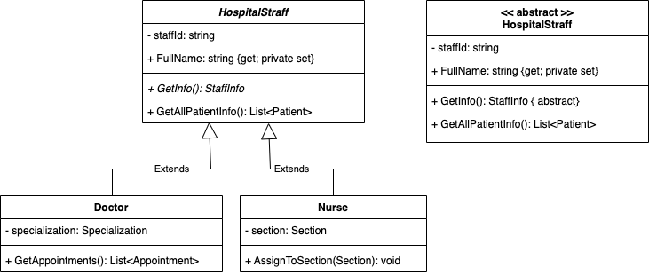
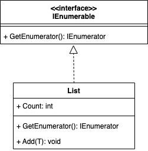
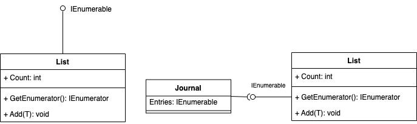
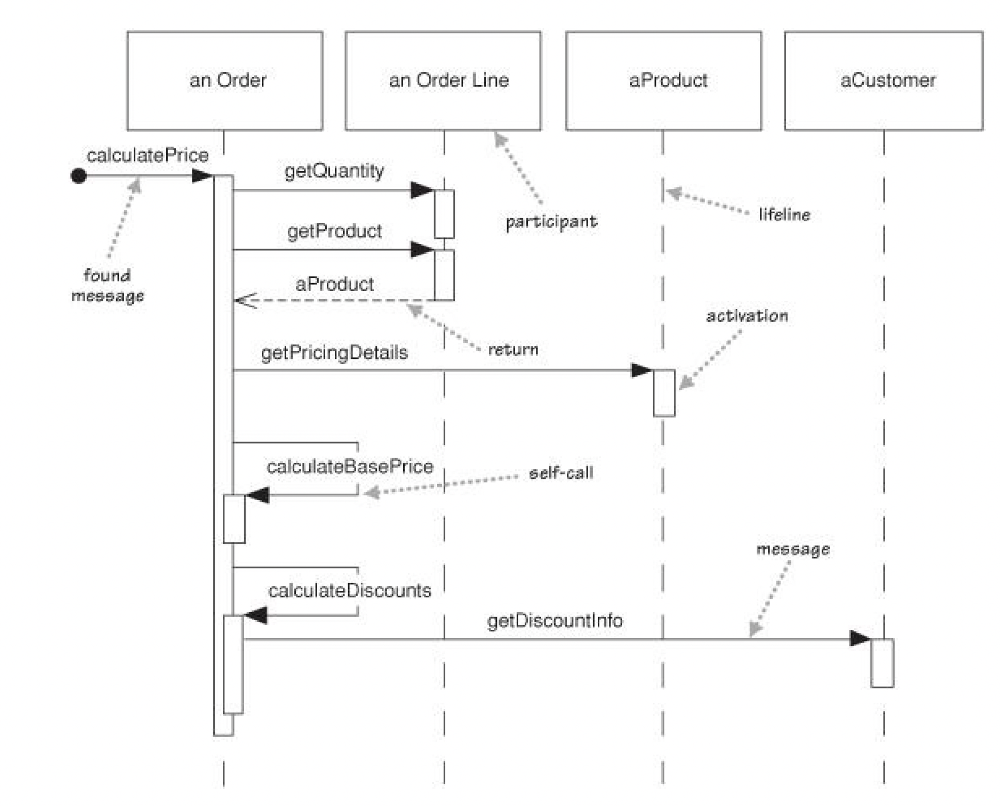
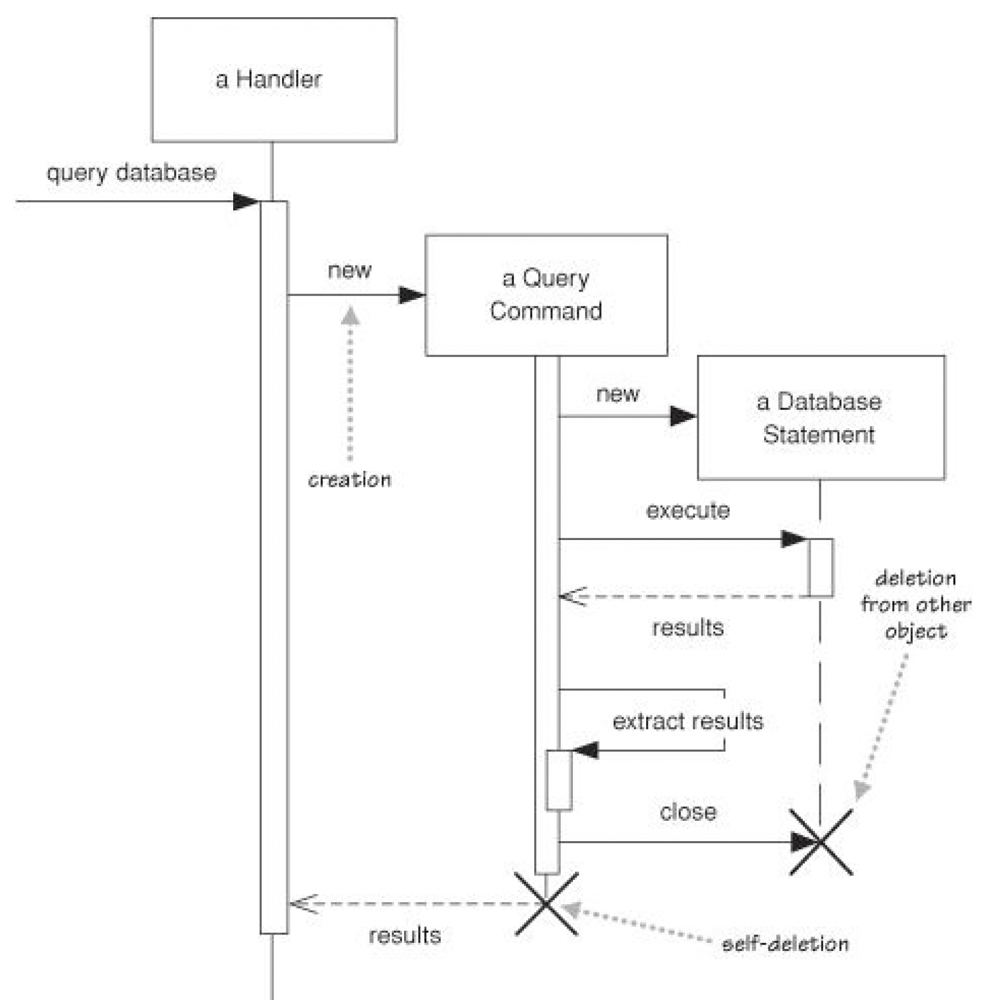
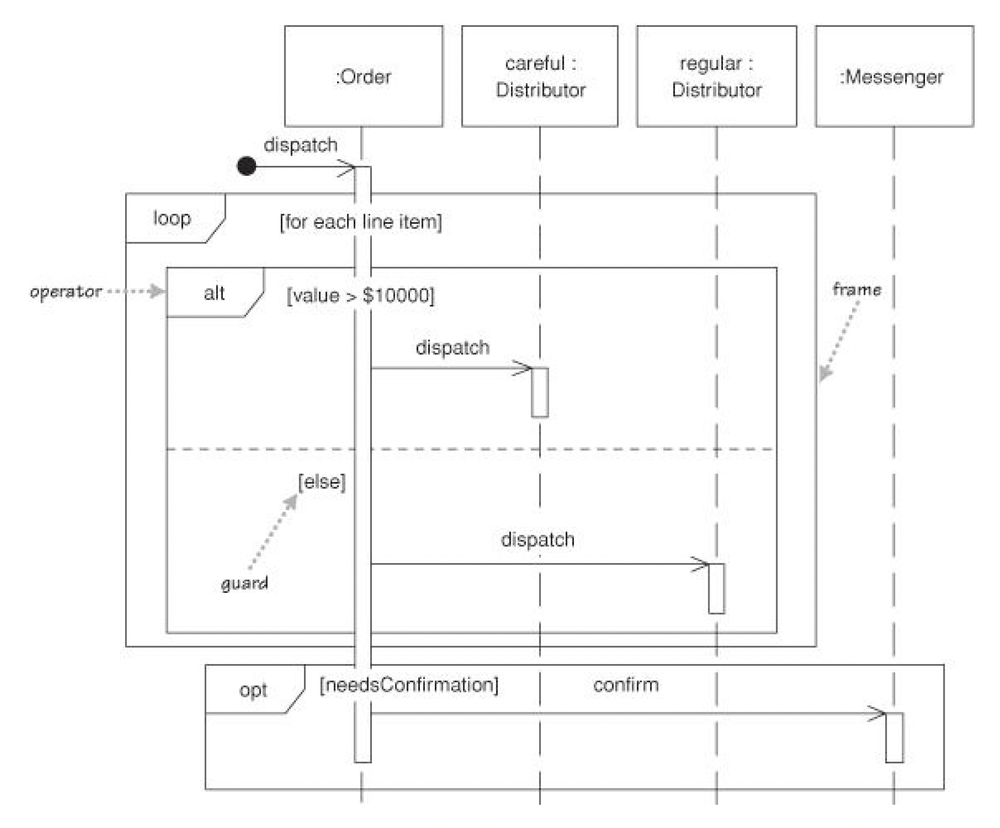

<!-- .slide: data-background="#003d73" -->

## UML

### Sequence diagrams

 <!-- .element style="width: 200px; position: fixed; bottom: 50px; left: 50px" -->

----

### Agenda

* Class types
* Sequence diagrams

---

## Abstract & Interface

----

### Abstract classes

* Class name is *italic*
* Abstract methods is *italic* or
    * `{abstract}`
* Remember Abstract class cannot be instantiated
* Remember classes inherits from abstract classes

----

### Abstract class

----

### Interfaces

* Class name is 'marked' with `<<interface>>`
* Remember all methods in an interfaces is considered 'abstract'\*

\* This is a lie from C# 8.0 :(

----

### Interfaces

---

## Sequence Diagrams

Try describing a complex call from with 3-4 classes to your neighbour

----

### Solution

* Simple diagram type
    * shows participant involved
    * interaction between these
* Notation is easy to understand

----

 <!-- .element: style="height: 650px" -->

----

### Explanation

Contains

* Participants with lifelines
* Method calls
    * and return arrows
* activation bars

----

### Object creations

 <!-- .element: style="height: 600px" -->

----

### Loop and alternatives

 <!-- .element: style="height: 600px" -->

----

### Operators

* **alt** Alternative, multiple fragment - one will execute
* **opt** Optional, fragment may execute
* **loop** Loop, fragment may execute multiple times
* **par** Parrallel, fragments will execute in parallel (next semester)

---

## References