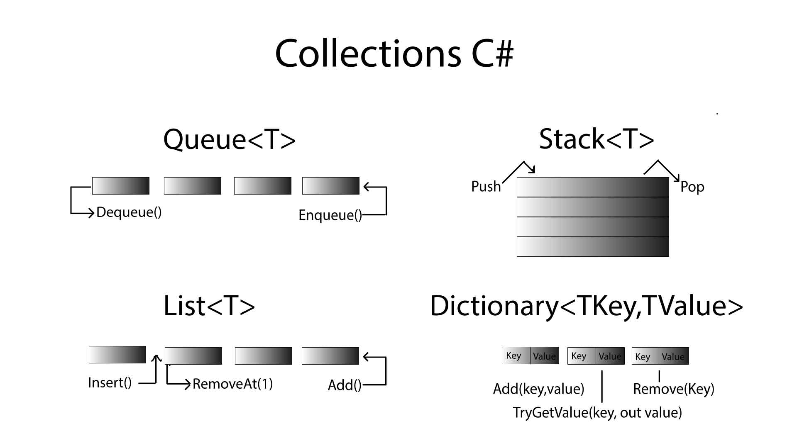
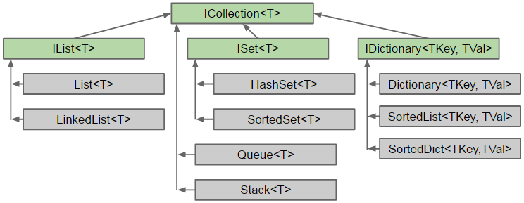

<!-- .slide: data-background="#003d73" -->

# Collections types

## Mutability / immutability

 <!-- .element style="width: 200px; position: fixed; bottom: 50px; left: 50px" -->

note:
TODO: Husk at export med notes

----

## Agenda

* List
    * IReadOnlyList
* Queue
* Set
* Dictionary

---



----

## `List`

This we have already seen

* Encapsulates an array
* Resizes when necessary
* When to use
    * size is no fixed over timer
    * access elements by index
    * or iterate

----

## `List` methods

* [List methods](https://learn.microsoft.com/en-us/dotnet/api/system.collections.generic.list-1?view=net-8.0#methods)
    * Find(Predicate<T>): T
    * ForEach(Action<T>): void
    * Sort(): void
    * IndexOf(T t): int - Remember equals


----

### `IReadOnlyList`

* Sometimes you need a collection that is unchangable (umutable)
    1. clients don't need to change
    1. fewer option of usage for client

```csharp
List<int> ints = new List<int>();
// What and why??
IReadOnlyList<int> readOnlyList = (IReadOnlyList<int>) ints;
IReadOnlyList<int> readOnlyListCopy = ints.AsReadOnly();
```

---

## `Queue`


* Generic collection type (like List<T>)
* First in, First out (FIFO)

----

### `Queue` Methods

* `Enqueue(T t): void`
    * Adds a new element to the end
* `Peek(): T`
    * Returns first element without altering
* `Dequeue(): T`
    * Returns first element and removes

----

## When to use

* When we want elements in a specific order
* Efficiently mutatation
* Dynamic size - liked List
* Alternative to FIFO
    * `Stack` - Last in, First out (LIFO)
    * `PriorityQueue` - out based on Priority

---

## `ISet`

* Stores unique values
* No order
* Implementations
    * `HashSet`
    * `SortedSet`
    * `FrozenSet`

----

### `HashSet`

* Dynamic size
* Elements are added/retrived by `GetHashCode` and `Equals`
    * Remember `GetHashCode`?
    * Remeber `Equals`?

 <!-- .element: class="fragment" -->

----

### `HashSet` Methods

* `Add`, `Remove`, `Contains`
* Set methods
    * `Overlaps`
    * `UnionWith`

----

### When to use a ISet

* To remove duplicates from a list (or other collection)
    * List -> Set -> List
* To make sure there are no duplicates
* Fast lookup of element

----

### `SortedSet`

* Sorted by natural order (IComparable<T>)

```csharp
public interface IComparable<T> {
    int CompareTo(T t);
}
```

----

### IComparable 'rules'

* *Less than zero* - This object precedes the object specified by the CompareTo method in the sort order.
* *Zero* - This current instance occurs in the same position in the sort order as the object specified by the CompareTo method argument.
* *Greater than zero* - This current instance follows the object specified by the CompareTo method argument in the sort order.

note:

```csharp
public class Word: IComparable<Word> {
    public readonly string word;
    public Word(string word) {
        this.word = word.ToLower();
    }

    public int CompareTo(Word? other) {
        if (ReferenceEquals(this, other))
            return 0;
        if (other == null) 
            return 1;
        return word.CompareTo(other.word);
    }
}
```

---

## Dictionary

* Almost like as Set
    * but with a key and a value
    * Key determines uniqueness
    * Value is bound to Key


----

### Dictionary example

```csharp
public class Nudansk {
    private Dictionary<Word, Meaning> words =
                new Dictionary<Word, Meaning>();
	public Nudansk() {
		words.Add(new Word("Kilde"), new Meaning("..."));
        //TODO: words.Add(new Word("Kilde"), new Meaning("..")); // Fails with excetion - since key is already added. Next updates value
		words[new Word("Kilde")] = new Meaning("...");
	}
    public Meaning GetMeaning(string word) {
        return words[new Word(word)];
    }
    public void Print() {
		foreach (KeyValuePair<Word, Meaning> keyValue
                                         in words) {
			Console.WriteLine(keyValue.Key
                     + " -> " + keyValue.Value);
		}
	}
}
```

note:

```csharp
public class Meaning {
    public string Description { get; private set; }
    public Meaning(string description) {
        Description = description;
    }
}
public class Word: IComparable<Word> {
    public readonly string word;
    public Word(string word) {
        this.word = word.ToLower();
    }
	
    public override bool Equals(object? other) {
        if (other is Word)
        {
            Word otherWord = other as Word;
            return word.Equals(otherWord.word);
        }

        return false;
    }
    public override int GetHashCode() {
        return word.GetHashCode();
    }
}

public class Nudansk {
    private Dictionary<Word, Meaning> words = new Dictionary<Word, Meaning>();
	
    public Nudansk() {
        words.Add(new Word("Kilde"), new Meaning("vand fra jordbunden der strømmer eller springer ud på overfladen"));
        words[new Word("Kilde")] = new Meaning("person som har videregivet oplysninger til fx presse eller politi");
		
    }
    public Meaning GetMeaning(string word) {
        return words[new Word(word)];
    }
    public void Print() {
        foreach (KeyValuePair<Word, Meaning> keyValue in words) {
            Console.WriteLine(keyValue.Key + " -> " + keyValue.Value);
        }
    }
}

```

----

TODO: Add why Dictionary

---

## hierarchy



---

## Reference

* [IReadOnlyList](https://learn.microsoft.com/en-us/dotnet/api/system.collections.generic.ireadonlylist-1?view=net-8.0)
* [Queue](https://learn.microsoft.com/en-us/dotnet/api/system.collections.generic.queue-1?view=net-8.0)
    * [With priority](https://learn.microsoft.com/en-us/dotnet/api/system.collections.generic.priorityqueue-2?view=net-8.0)
* [Set](https://learn.microsoft.com/en-us/dotnet/api/system.collections.generic.iset-1?view=net-8.0)